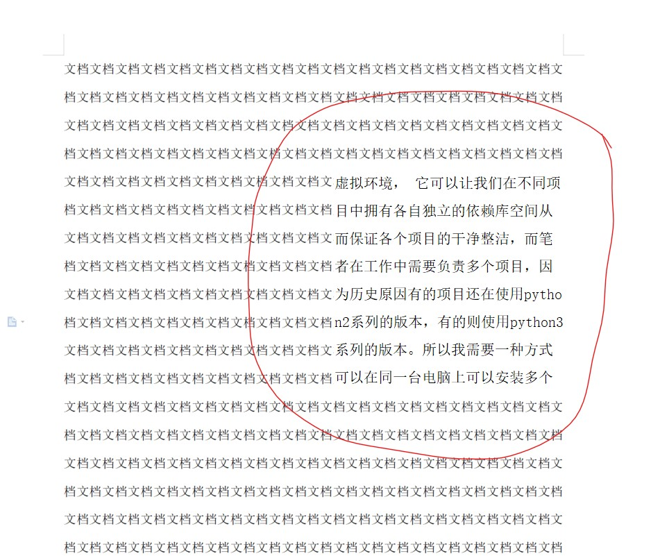

# touchFish
打开一个和大多数word文件内部显示的内容类似的无缝窗口

# 使用方法
1. 打开之后选择一个文件，会创建一个无缝的窗口
2. 左键能正常选中 ctrl+C、V、A就是复制、粘贴、全选
3. 右键点住可以拖动这个窗口
4. esc键是关闭
5. 目前只支持打开txt文件（需要是一些常用编码类型的文件）

# 一些快捷键
1. 右键：拖动窗口
2. ESC：关闭窗口
3. Ctrl +：增大字体
4. Ctrl -：减小字体
5. Ctrl 0：扩大宽度
6. Ctrl 9：减小宽度
7. Alt +：增大高度
8. Alt -：减小高度
9. Ctrl Alt +：增大行间距
10. Ctrl Alt -：减小行间距

# 效果如下

ps：可能跟分辨率有关，我在不同的显示器上看到的效果不太一样，有的显示器上看起来和word融合得非常好
